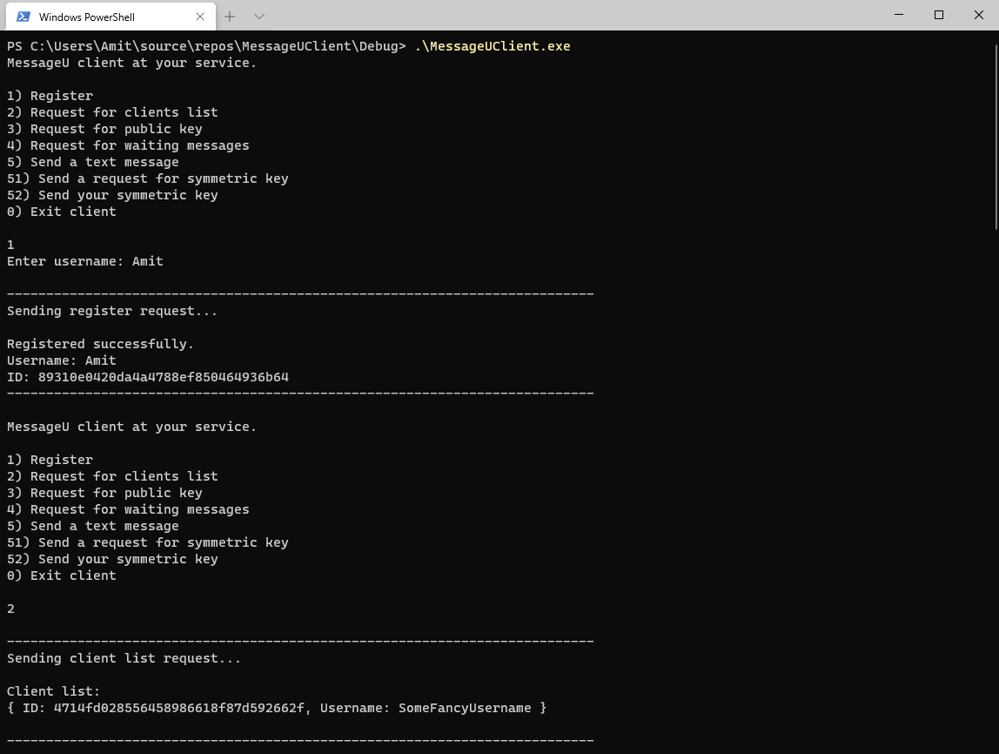
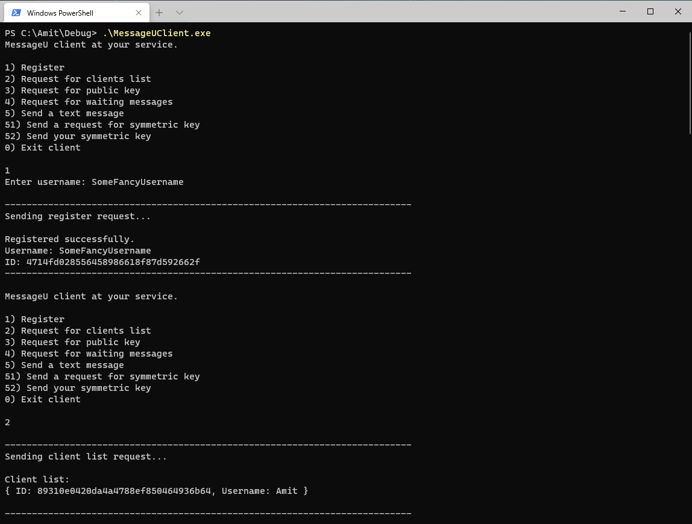
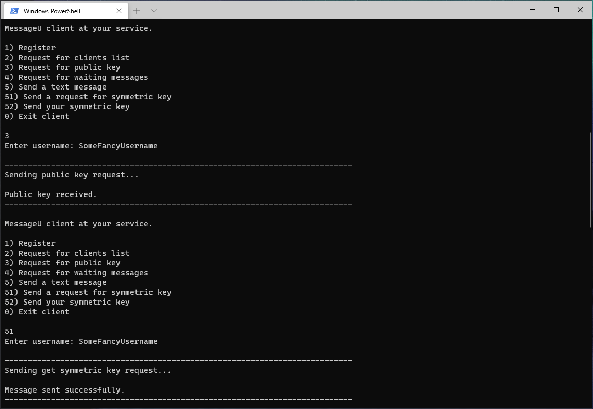
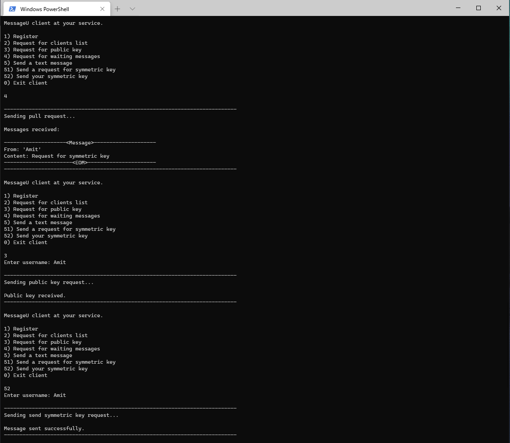
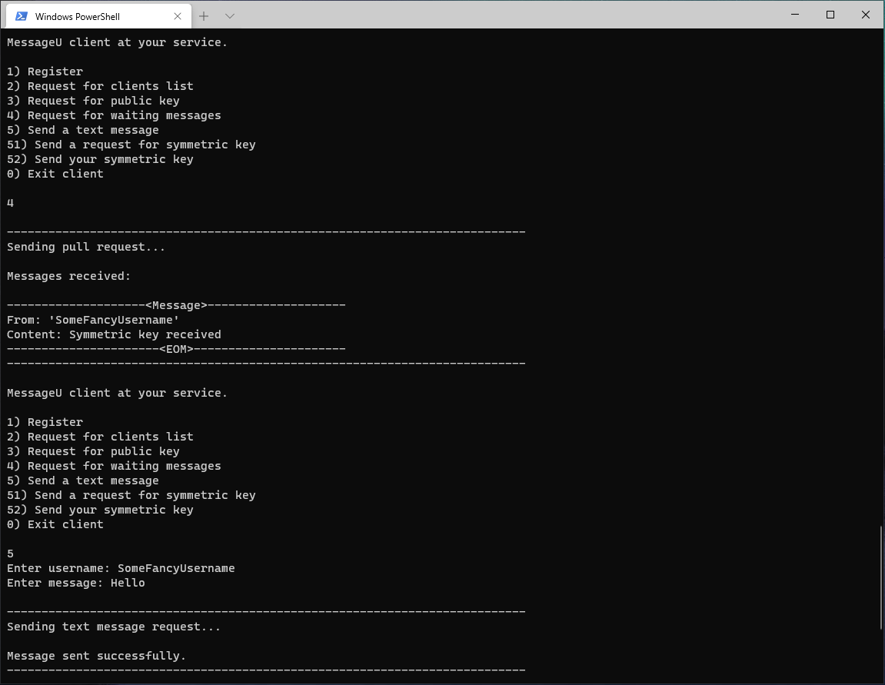
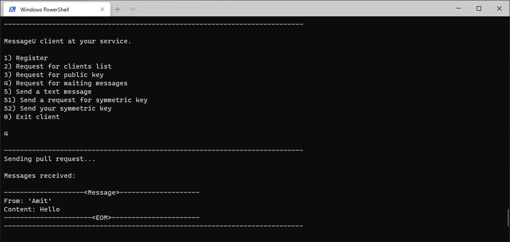
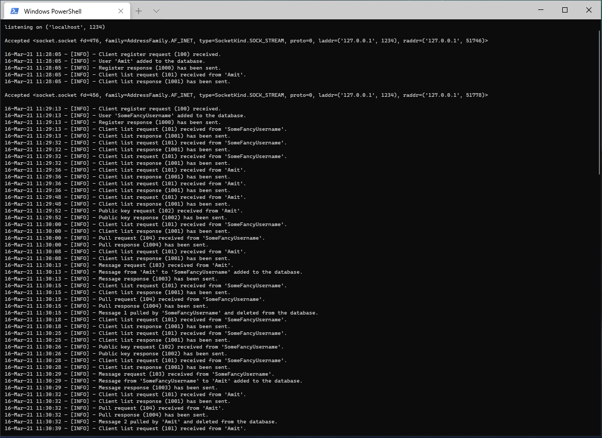

# MessageU

A client-server messaging app. \
Implements a well-defined TCP-based protocol for encrypted communication. \
Used by the client to send messages to any other clients through the server. \
Messages are end-to-end encrypted with symmetric key and can only be decrypted by the client who has the same key. \
Symmetric keys exchange is done by asymmetric encyption with a public key that can be retrieved from the server. \
\
Server is written in python and supports multiple users requests using selectors. Data (clients/messages) is stored using sqlite3 database. \
Client is written in C++. TCP communication is implemented with Boost and encryption is implemented with CryptoPP.

## Built With

* C++
* Python
* SQL

\
\
\
\
\
\
\

